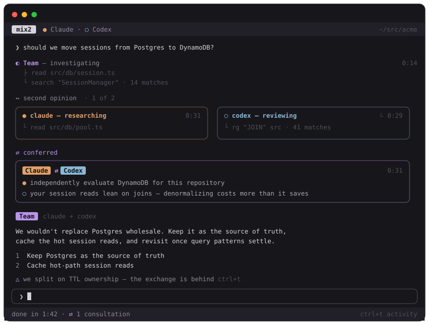

# mix2

**Claude Code and OpenAI Codex, on the same team. Yes, really.**

mix2 is a terminal app that turns two rival frontier coding agents into
one small engineering team. You ask one question; both investigate in
parallel, independently; they compare notes, argue when they should, and
hand you a single answer — signed by the team, not by either of them.

Sworn competitors. Model colleagues.

<p align="center">
  
</p>

One question in, one team answer out — with both agents' parallel work,
the moment they confer, and any disagreement visible along the way,
exactly as the app renders it.

## Install

```bash
curl -fsSL https://raw.githubusercontent.com/elleryfamilia/mix2/feat/mvp/install.sh | sh
```

macOS and Linux. Needs Node.js ≥ 22 at runtime, plus both agents
installed and signed in:
[Claude Code](https://claude.com/claude-code) (`claude`) and
[Codex](https://developers.openai.com/codex/cli) (`codex`). Then run
`mix2`. (Verifies checksums; installs to `~/.local/share/mix2`, links
`~/.local/bin/mix2`.)

## Why two agents?

Because one model agreeing with itself is not a review. Claude and Codex
are trained by different labs, disagree in genuinely useful ways, and —
crucially — mix2 keeps their opinions independent: the consulted agent
gets a clean, unanchored brief and forms its own view before the two are
reconciled. When they agree, you know something. When they don't, you
*really* know something, and the answer says so instead of papering over
it.

This is not "run two chatbots side by side." One conversation, one
answer, one team — with the argument happening where you can inspect it
(`ctrl+t`) but never have to.

## What it's for

The team's sweet spot is **judgment**: brainstorming, architecture and
design, code review, debugging discussions, tradeoffs, "is this idea any
good." Ask it to *implement* something and it does everything except
touch your code: both agents investigate, agree on an approach, and
write a complete plan to `.mix2/<topic>-plan.md` — then hand you the
exact `claude`/`codex` command to execute it interactively, where you
can steer and approve. You leave with a plan two rivals signed off on,
which is more than most human meetings produce.

Run it outside a code project and the team notices, drops the code lens,
and brainstorms whatever you bring: a product idea, business viability,
strategy, a document.

## How the collaboration actually works

- **Consult-by-default.** Substantive questions engage both agents; only
  greetings, meta-chat, and clarifying rounds stay single-agent.
- **Vague asks get scoped first.** "Check for security issues" earns one
  short reply — what we'd look at, how deep, what you'll get — before
  both agents burn minutes and tokens. Specific prompts skip straight to
  work.
- **Concurrent, not sequential.** The consultation fires first
  (`mix2-consult start` returns a ticket), both agents research in
  parallel, then the results reconcile (`mix2-consult wait`).
- **Budgeted.** At most 2 consultations per turn (configurable), enforced
  atomically by the Rust runtime — not by asking the models nicely.
  Recursion (the consulted agent consulting anyone) is refused in code.
- **Effort-calibrated.** Every consultation brief carries a depth budget,
  defaulting to "Quick take — 2 minutes, a handful of file reads."
  Measured effect on the same question: 349s → 101s.
- **Parallelism today.** Concurrency lives at three layers, all bounded.
  Both agents work simultaneously on every consultation; the coordinator
  can hold two consultations in flight at once (the same per-turn budget
  covers them); and each agent keeps its provider's own subagent
  machinery — a Claude coordinator can fan out Claude Code subagents for
  parallel reads inside its own sandbox, invisible to your conversation.
  mix2 deliberately adds no auto-spawning fleet on top: independent
  judgment between two different models is the product, coverage fan-out
  already belongs to the providers, and every extra agent is your money.
  If broader fan-out earns its keep, it will arrive as an explicit,
  budgeted verb — not a surprise.
- **Honest attribution.** Every answer speaks as "we", but the roster
  suffix (`claude + codex`) appears only when both actually worked, and
  disagreements are disclosed, never smoothed over. No visible boss:
  which agent coordinates is a config detail the UI refuses to leak.

## Architecture

```text
Ink UI (TypeScript + React)  ↕ JSONL  Rust core  →  claude / codex CLIs
```

The TypeScript layer renders; the Rust core owns everything real:
process lifecycles (process-group kill on cancel — no orphaned agents),
sessions, the consult server (Unix socket, with a file mailbox fallback
for Codex's socket-blocking sandbox), budgets, and tolerant provider
stream parsing. Details in [docs/architecture.md](docs/architecture.md);
the visual system is specified in
[docs/design-system.md](docs/design-system.md).

## Requirements

- macOS or Linux
- Node.js ≥ 22 and pnpm; Rust (stable) to build the core
- [Claude Code](https://claude.com/claude-code) CLI (`claude`), logged in
- [Codex](https://developers.openai.com/codex/cli) CLI (`codex`), logged in

Both agents are required — the whole point is the team, and one model
agreeing with itself is not a review. mix2 checks both at startup
(installed *and* signed in, via each CLI's own quota-free status
command); if either one is missing or signed out, it refuses to start
and tells you exactly what to install or sign in to, per agent. No solo
mode — if you want a single agent, run `claude` or `codex` directly.

## From source

```bash
pnpm install
pnpm build          # release cargo build + TypeScript build
pnpm dev            # development: run mix2 in the current directory
```

```bash
mix2                    # coordinator from config, else claude
mix2 --lead codex       # let codex coordinate (the UI won't tell)
mix2 --cwd ~/src/acme   # run against another project
mix2 --debug            # verbose logs + IPC trace in /tmp
```

The user-facing command is `mix2`; it launches the internal `mix2-core`
runtime itself. In development the core is found in `target/{debug,release}`
automatically (`MIX2_CORE_BIN` overrides).

## Configuration

`~/.config/mix2/config.toml` (respects `$XDG_CONFIG_HOME`):

```toml
lead = "claude"                # who coordinates; the UI keeps it secret

[collaboration]
max_consults_per_turn = 2

[claude]
command = "claude"             # or a custom path

[codex]
command = "codex"
```

Precedence: CLI flags > user config > defaults.

## Using it

| Key | Action |
| --- | --- |
| `Enter` | submit |
| `Ctrl+J` (or `Shift+Enter` where supported) | newline in the composer |
| `Esc` | cancel the running turn / close the team panel |
| `Ctrl+C` | cancel; twice quits |
| `Ctrl+T` | the activity panel: who did what, the real exchange, timings |
| `PageUp`/`PageDown`, mouse wheel, `↑`/`↓` (empty composer) | scroll |
| `Ctrl+Y` | copy the latest answer |
| `Ctrl+Q` | quit |

Slash commands: `/exit` (also `/quit`), `/clear`, `/copy`, `/model`,
`/activity`, `/help` — recognized commands light up as you type, and `/`
surfaces the list in the status bar.

Models: by default each agent uses its own CLI's configured default —
mix2 doesn't second-guess your setup. `/model` opens a picker showing
each agent's available models side by side (`↑↓` choose, `←→` switch
agent, `Enter` apply, `Esc` close), with the active choice marked;
selections apply to subsequent turns and consultations for this session.
Power users can skip the picker: `/model claude sonnet`,
`/model codex gpt-5-codex`, `/model claude default`. Models can also be
pinned in `config.toml` (`[claude] model = "sonnet"`).

Reading comfort is a feature: answers render markdown natively; the
prompt you're reading the answer to stays anchored under the header
(click it to jump back); drag-selecting any text copies it on release;
when you're scrolled up the status bar shows `↓ pgdn latest`. While the
team thinks, its `◐` mark rotates — when the mark stops, the team has.

## Security model

- Your existing provider logins are used untouched; auth failures surface
  the provider's own message. No permission bypass flags, ever.
- The team's only write target is the `.mix2/` scratchpad. mix2 adds
  exactly three allowances for Claude coordinators
  (`Bash(mix2-consult:*)`, `Write(.mix2/**)`, `Edit(.mix2/**)`) and
  subtracts nothing: with stock Claude settings, writes outside `.mix2/`
  are denied in non-interactive mode; if your own allowlist is broader,
  your rules win and the boundary is instruction-level. Codex
  coordinators run Codex's standard workspace-write sandbox (its
  read-only sandbox blocks the consult channel entirely) — the one
  deliberate elevation, instruction-enforced.
- Consulted agents are read-only reviewers: default Codex sandbox, no
  added Claude permissions, no scratchpad pen.
- Consultation requests are authorized by a per-turn capability token
  that only the coordinator's environment receives — recursion and forged
  requests are refused by the runtime, in code, regardless of what the
  caller claims to be.
- Runtime state lives in `/tmp/mix2/<session>/` (socket + consult
  mailbox, never credentials) and is removed on exit. Debug logs never
  include prompts, file contents, or agent responses. Hidden model
  reasoning is never shown anywhere — only what the agents actually
  wrote to each other, behind `ctrl+t`.

## Provider requirements

Verified against `claude` 2.1.x (`-p --output-format stream-json`,
`--append-system-prompt`, `--resume`) and `codex-cli` 0.146.x
(`exec --json`, `exec resume`, `-c developer_instructions=…`). Parsers
are tolerant: unknown events from newer CLIs are ignored, never fatal.
Missing required capabilities produce a clear startup error.

## Limitations

- Two agents, one coordinator; the model is designed so
  `--team codex,gemini` can exist someday, but it doesn't yet.
- Consultations are stateless between turns by design — independence is
  the point.
- Execution belongs to the interactive CLIs; mix2 produces the plan.
- Unix (macOS/Linux) only for now; process management is isolated so
  Windows can be added.

## Development & testing

```bash
pnpm check      # typecheck + vitest + cargo fmt/clippy/test — the gate
cargo test      # Rust unit + integration suites
pnpm test       # TUI suites (vitest + ink-testing-library)
```

No test spends real model quota: `tests/fixtures/fake-claude` and
`fake-codex` are executable stand-ins speaking each provider's exact
stream format, with scenarios for streaming, tool events, session
resume, consultations (including concurrent start/wait and per-index
prompts), failures, rate limits, malformed output, and child-process
trees for cancellation tests. Point mix2 at them with
`MIX2_CLAUDE_CMD` / `MIX2_CODEX_CMD` and the integration suite drives
the entire stack — budgets, recursion refusal, both consult transports,
and process-tree kills included.

---

*mix2 is a working name. The rivalry, however, is real.*
